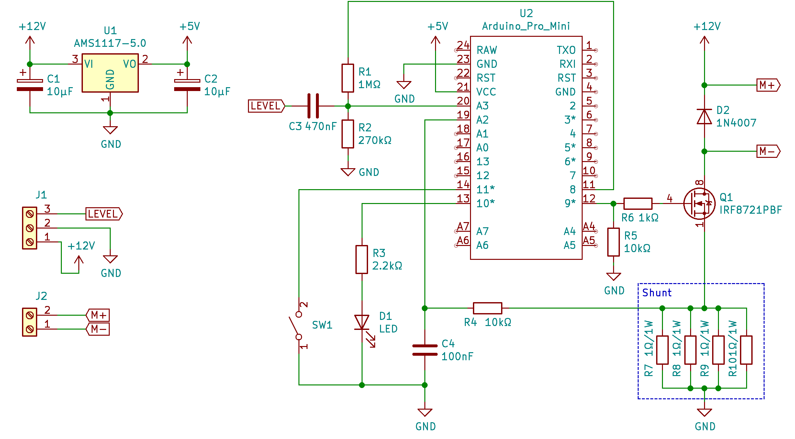
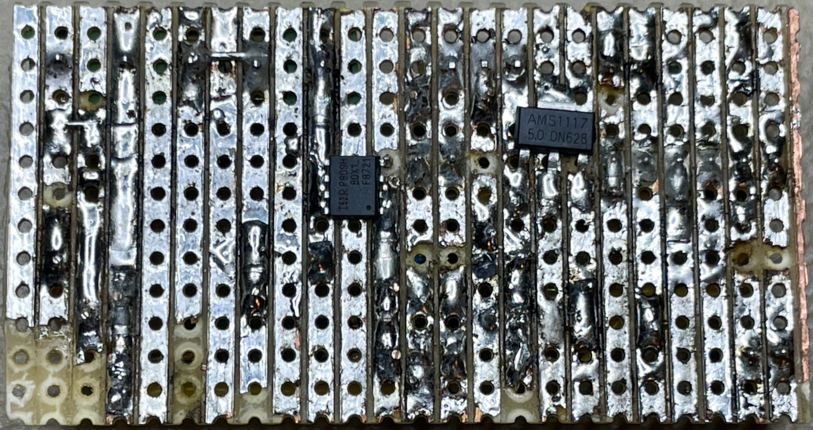
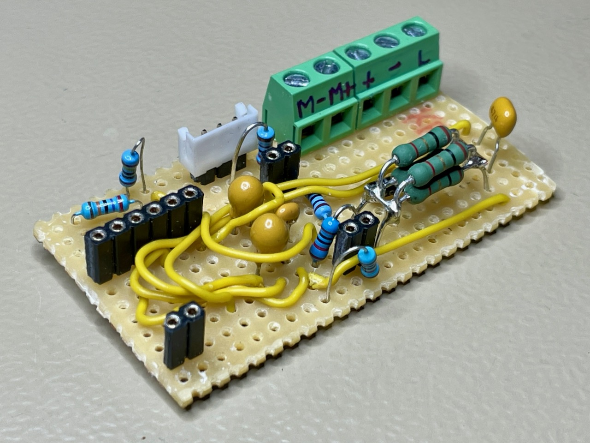
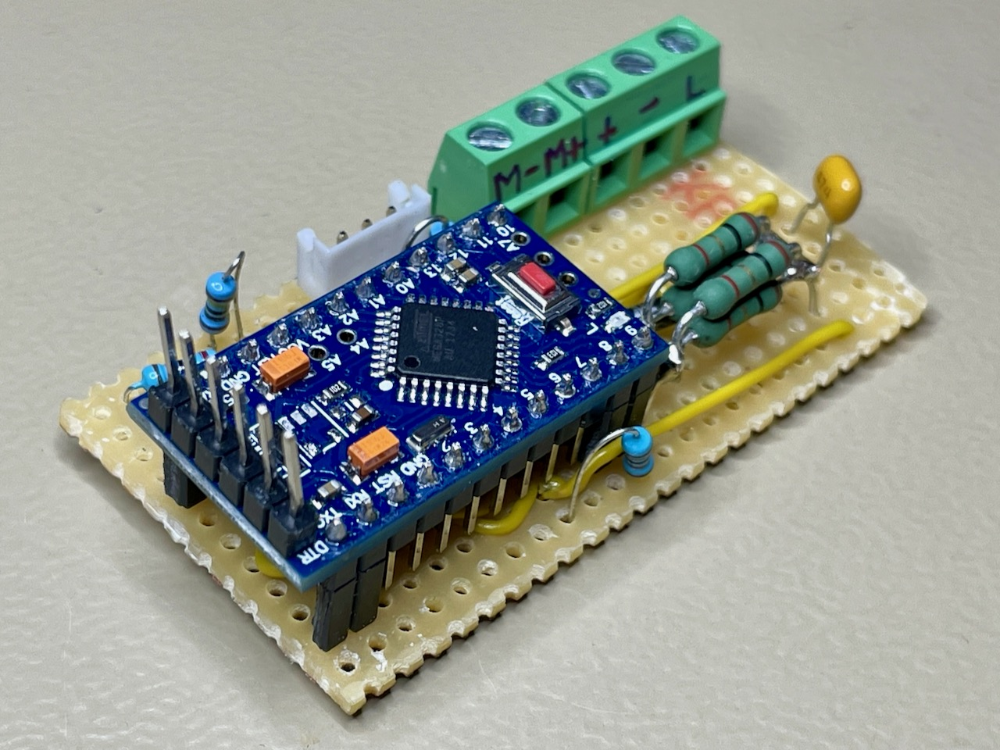
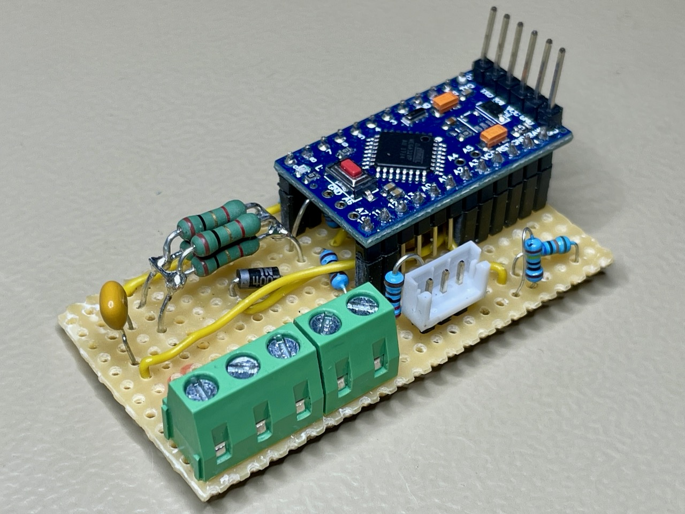

# Smart Water Pump

This repository contains the Arduino firmware for smart water pump controller.

The code has been implemented and tested on an Arduino Pro Mini clone board based on the ATmega328P microcontroller.

This project uses Git submodules. In order to get its full source code, please clone this Git repository to your local workspace, then execute the follwoing command from within the repository's root directory: `git submodule update --init`.

Unless stated otherwise within the source file headers, please feel free to use and distribute this code under the GNU General Public License v3.0.

## Prerequisites

* ATmega328P based Arduino Pro Mini, Arduino Nano or similar model
* Desolder the on board voltage regulator and power LED from the Arduino board
* Custom bootloader from: https://github.com/microfarad-de/bootloader

## Theory of Operation

The smart water pump controller is a convenience feature for caravaning applications.
One usually fills the water of the caravan on board tank from a canister trolley of some sort.
Whereas a 12 Volt water pump is often used to transfer the water from the canister into the on board tank.
The smart pump controller provieds the following features:
* Automatically deactivate the water pump if the latter runs dry
* Automatically deactivate the water pump if the caravan tank gets full when filling through the
  caravan's city water connection
* Periodically attempt to top up the caravan tank when using the caravan's city water connection
The controller detects one of the following three water pump states by constantly measuring its current draw:
* Regular pumping
* Water flow blocked by the float valve when the caravan tank becomes full
* Dry run due to the external canister running out of water
The controller is designed to work with "Comet Lux-Plus" water pump whose approximate current draw measured at 13.0 V is shown in the following table:

| State          | Current  |
|----------------|----------|
| Pumping        | 3.7 A    |
| Full / blocked | 2.4 A    |
| Dry run        | 0.6 A    |

Pumping is started and stopped by pressing the push button. The pump will be automatically deactivated if the dry run condition has been detected.

If the full tank condition is detected, the controller will deactivate the pump and go into the standby mode. Whereas the controller will automatically attempt the reactivate the water pump once per hour in order to top up the tank.

A LED indicates the operation status through different blinking patterns as shown in the table below:

| Blinking Pattern              | Description                                      |
|-------------------------------|--------------------------------------------------|
| Always on                     | Pumping water                                    |
| Always off                    | Power off state, press button to start pumping   |
| Blink once every 2 s          | Standby state, the pump will start once per hour |
| Inverse blink every 0.5 s     | Error, calibration needed                        |
| Even blink with 1 s period    | Pumping current calibration                      |
| Even blink with 0.5 s period  | Full / blocked current calibration               |
| Even blink with 0.25 s period | Dry run current calibration                      |

## Calibration Procedure

Enter the calibration mode by long-pressing the button during 5 seconds. Make sure that the pump is immersed in water and the output hose ins not obstructued. The pump will start and the LED will blink evenly with a 1 second period to indicate the pumping current calibration.

Long-press the button during 1 second to store the current value for the regular pumping operation. The LED blinking period will decrease to 0.5 seconds to indicate the full tank current calibration.

Squeeze the pump output hose to ensure that the water flow is completely blocked, then press the button during 1 second to store the current value. The LED blinking period will further decrese to 0.25 seconds to indecate the dry run current calibration.

Raise the pump above water level to ensure it is running dry, then long-press the button during 1 second to store the current value. If the calibration procedure was successful, the LED will turn off and the controller will go to the power off state.

If the LED stays constantly lit and briefly turns of every 0.5 s, then calibration procedure has been faulty and needs to be repeated.

## Circuit Diagram

The following picture shows the smart pump controller circuit diagram:

[schematic.pdf](doc/schematic.pdf)

## PCB Layout

The circuit is assembled on a prototyping stripboard PCB as shown in the follwoing pictures:

## Gallery

Following are further pictures of the finished project:

